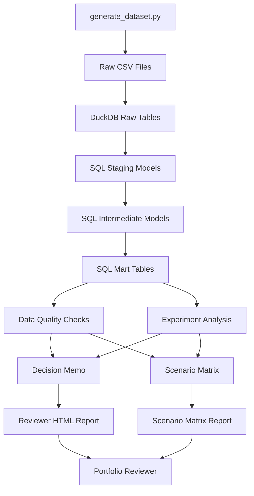
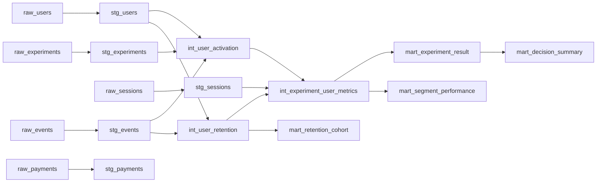
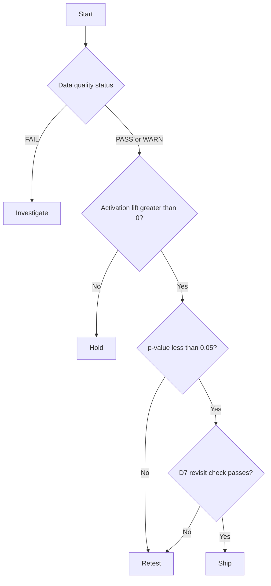
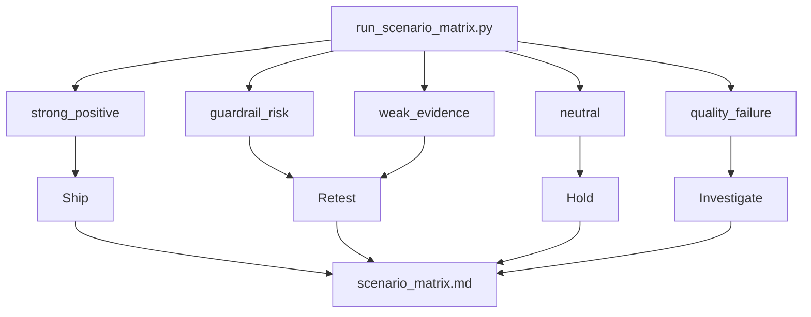
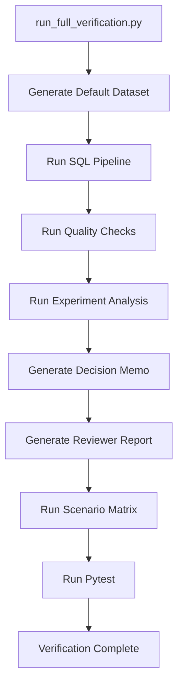

# Architecture Diagram

This document gives a visual overview of DecisionOps Lab.

The goal is to make the workflow easy to understand before reading the code.

## End-to-End Workflow



## SQL Modeling Layers



## Decision Rule Flow



## Scenario Matrix Flow



## Verification Flow



## Main Commands

Run the full workflow locally:

```bash
python scripts/run_full_verification.py
```

Run only the scenario matrix:

```bash
python scripts/run_scenario_matrix.py
```

Run the default strong-positive case manually:

```bash
python scripts/generate_dataset.py --scenario strong_positive
python scripts/run_pipeline.py
python scripts/run_quality_checks.py
python scripts/run_experiment_analysis.py
python scripts/generate_decision_memo.py
python scripts/generate_review_report.py
pytest
```

## What to Review First

Recommended review order:

1. `reports/review_report.html`
2. `reports/scenario_matrix.md`
3. `docs/DECISION_RULES.md`
4. `docs/MART_LAYER.md`
5. `scripts/run_full_verification.py`

## Claim Boundary

This architecture is designed for a public portfolio project using synthetic data. It demonstrates workflow design and reproducibility, not production infrastructure scale.